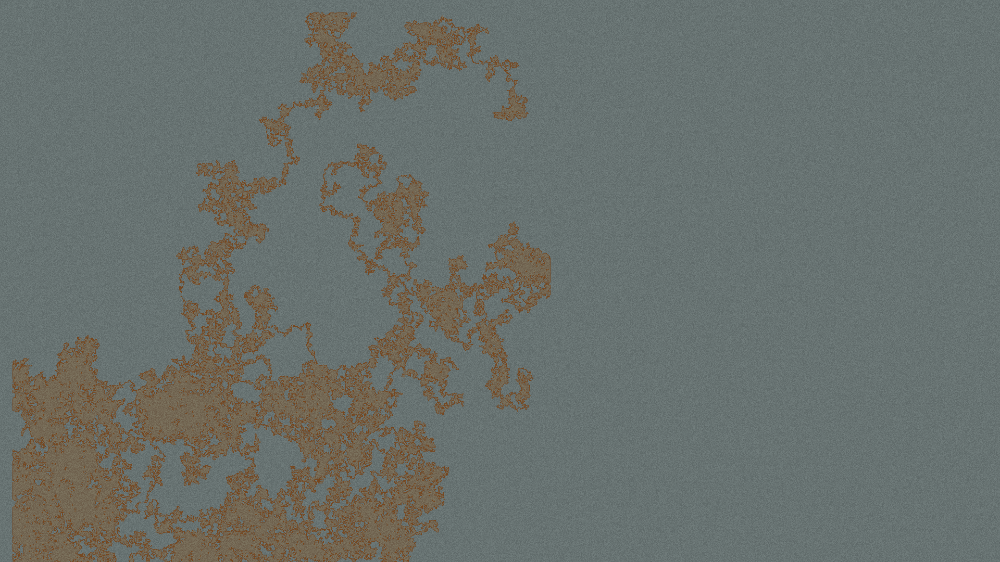

# Wander

Wander is a simple map generator.
It just picks a random position in the viewport and a random walker just paints the tile it walks onto.
Colors and image size are currently not controllable.

## Setup

`git clone https://github.com/getriot/Wander.git`

## Usage

`perl index.pl`

## Example Output
